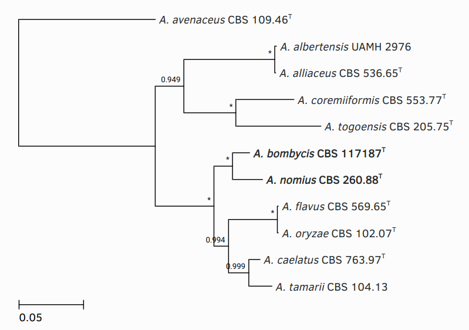

# fungphy
Fungal marker-based phylogenetics toolkit

## Usage
Clone, set up virtualenv, install fungphy
```sh
git clone https://github.com/gamcil/fungphy.git
cd fungphy
python3 -m virtualenv venv
source venv/bin/activate
pip3 install -e .
```

### Setup
Initialise database
```python3
>>> from fungphy.database import db
>>> db.create_all()
```

Scrape aspergilluspenicillium.org for Aspergillus, Penicillium & Talaromyces markers
```python3
>>> from fungphy import scraper
>>> good, bad = scraper.scrape()
>>> with open("table.csv", "w") as fp:
...    for sp in good:
...        columns = ",".join(sp)
...        fp.write(columns) 
```

Import .csv
```python3
# Genus|Species|Reference|MycoBank ID|Type|Ex-types|Subgenus|Section|*markers

>>> from fungphy import importer
>>> with open("table.csv") as fp:
...    importer.parse_csv(fp)
```

### Express usage
```python3
>>> from fungphy import plot
>>> table, msa, tree = plot._run(
...     genera=["Aspergillus"],
...     species=["avenaceus", "alliaceus", "albertensis", "tamarii", "caelatus",
...              "oryzae", "flavus", "nomius", "bombycis", "coremiiformis", "togoensis"],
...     markers=["ITS", "BenA", "CaM", "RPB2"],
...     trim_msa=True,
...     run_fasttree=True,  # Generate tree using FastTree
...     show_tree=True,
...     outgroup="avenaceus",  # Root this tree on A. avenaceus
...     bold=["nomius", "bombycis"],  # Bolden leaf labels for A. nomius and A. bombycis
...     types=["albertensis", "tamarii"]  # Use holotype strain name
... )    
```



### Alignments & phylogeny
Currently, procedures are in the `plot` module, so import that
```python3
from fungphy import plot
```

Query DB for species
```python3
>>> species = plot.get_species(
...    genera=["Aspergillus"],
...    species=["avenaceus", "alliaceus", "albertensis", "tamarii", "caelatus",
...             "oryzae", "flavus", "nomius", "bombycis", "coremiiformis", "togoensis"],
... )
>>> species
[<Strain 464>, <Strain 465>, <Strain 469>, <Strain 471>, <Strain 472>, <Strain 474>, <Strain 475>, <Strain 482>, <Strain 483>, <Strain 493>, <Strain 494>]
```

Note that the returned objects are instances of the `Strain` class. The model hierarchy
is as follows:
```
Subgenus
  Section
    Genus
      Species
        Strain
          Marker
```

Since the species descriptions on aspergilluspenicillium.org describe just the type
and ex-types formally attached to the species name, there will only be one `Strain` per
`Species`. If more `Strain` objects are added, strain names can be specified using the
`strains` argument:

```python3
>>> species = plot.get_species(genera=["Aspergillus"], strains=["CBS 1234", ... ])
```

Retrieve marker sequences
```python3
>>> markers = plot.get_marker_sequences(species, marker="ITS")
>>> markers
[<fungphy.phylogeny.Sequence object at 0x7f90d6e4dc40>, ... ]
```

Note this returns instances of the `Sequence` class, which have headers and sequences

```python3
>>> sequence = markers[0]
>>> sequence.header, sequence.sequence[:20]
(464, 'AAGGATCATTACCGAGTGTA')
>>> sequence.fasta()
'>464\nAAGGATCATTACCGAGTGTAGGGTTCCCTCGTGGAGCCCAACC ... '
```

Phylogenetic procedures are stored in the `phylogeny` module
```python3
from fungphy import phylogeny as phy
```

Align markers
```python3
>>> msa = phy.align_sequences(markers, name="ITS", tool="mafft")
>>> msa
<fungphy.phylogeny.MSA object at 0x7f90d6e1fc10>
```

This returns an instance of `MSA`, which is a list-like class used to store aligned
`Sequence` objects:

```python3
>>> msa.records
[<fungphy.phylogeny.Sequence object at 0x7f90d6e16d00>, ... ]
```

Trim MSAs to first and last non gap-containing columns
```python3
>>> msa = phy.trim(msa)
```

Optionally, trim as above by a minimum number of non gap-containing columns
```python3
# Trim to first/last columns where at least 90% of sequences contain no gaps
>>> msa = phy.trim(msa, threshold=0.9)
```

Write to file in FASTA format
```python3
>>> with open("ITS.msa", "w") as fp:
...     fp.write(msa.fasta())
```

Back to the `plot` module, we can automate the above steps for multiple markers
```python3
>>> mmsa = plot.align_organisms(
...     species,
...     markers=["ITS", "BenA", "CaM", "RPB2"],
...     trim_msa=True
... )
Aligning ITS
Aligning BenA
Aligning CaM
Aligning RPB2
>>> mmsa
<fungphy.phylogeny.MultiMSA object at 0x7f90d6e4db20>
```

Note this returns an instance of `MultiMSA`, which is another list-like class, this time
used to store multiple instances of `MSA`
```python3
>>> mmsa.msas
[<fungphy.phylogeny.MSA object at 0x7f90d6e067c0>, ... ]
```

Write to file in FASTA format, as above
```python3
>>> with open("multi.msa", "w") as fp:
...     fp.write(mmsa.fasta())
```

Can also report partition intervals
```python3
>>> mmsa.partitions
[(1, 617), (618, 1098), (1099, 1606), (1607, 2562)]
```

Write to file in RAxML format
```python3
>>> with open("partitions.msa", "w") as fp:
...     fp.write(mmsa.raxml_partitions())
```

Ready to be analysed by e.g. modeltest-ng / raxml-ng.

MultiMSAs can also be re-read back into Python if given an accompanying RAxML format
partition file generated as above
```python3
>>> mmsa = phy.MultiMSA.from_msa_file("msa.fasta", "partitions.txt")
```

### Summary table
We can use the `Summary` class to generate a table of marker accessions for use in
publications.

```python3
>>> table = plot.Summary.make(species, markers=["ITS", "BenA", "CaM", "RPB2"])
>>> table.headers
['Organism', 'ITS', 'BenA', 'CaM', 'RPB2']
>>> table.rows
[['Aspergillus albertensis', 'EF661548', 'EF661464', 'EF661537', 'EU021628'],
 ['Aspergillus alliaceus', 'EF661551', 'EF661465', 'EF661534', 'MG517825'],
 ...]
```

Format as e.g. tab delimited file with headers
```python3
>>> formatted = table.format(delimiter="\t", show_headers=True)
>>> print(formatted)
Organism        ITS     BenA    CaM     RPB2
Aspergillus albertensis EF661548        EF661464        EF661537        EU021628
Aspergillus alliaceus   EF661551        EF661465        EF661534        MG517825
Aspergillus avenaceus   AF104446        FJ491481        FJ491496        JN121424
...
```

Write to file
```python3
>>> with open("markers.tsv", "w") as fp:
...     fp.write(formatted)
```

### Visualisation
Note above aligned `Sequence` objects use their respective strain's database row ID as a
header. This is to allow separate `MSA` instances to be linked in multi-locus analyses.
They are also used to lookup species information from the database when reading in a
tree file for visualisation.

Generate a tree from MSA using FastTree
```python3
>>> newick = phy.fasttree(mmsa)
```

This generates a tree in Newick format, so convert to an ETE3 toolkit `Tree` object.
Note we set our outgroup as *Aspergillus avenaceus*.
```python3
>>> tree = plot.read_tree(newick, outgroup="avenaceus")
```

Visualise the tree
```python3
>>> plot.show(tree)
```

This will open the ETE3 interactive tree browser for further manipulation. Magically,
all our species information (including superscript Ts to indicate ex-type strains) have
been filled in via the database (see top of page).

We can also load in trees generated using e.g. raxml-ng
```python3
>>> tree = plot.read_tree_from_path("path/to/file.nw")
```

Or multiple trees for same species generated through different methods
```python3
>>> tree = plot.read_trees_from_paths(["tree1.nw", "tree2.nw"], merge=True)
```

With `merge=True`, support values for identical clades are merged; this allows
e.g. placing posterior probabilities from Bayesian inference on a maximum likelihood
tree, and vice versa. Note that unfortunately ETE3 reads in support values numerically,
and does not allow combined values generated by e.g. `IQTree -s msa --alrt 1000 -B
1000`.
Thus `fungphy` does not support these either.
